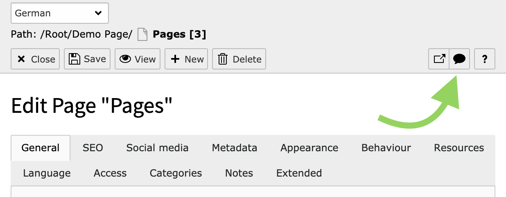

# TYPO3 Extension `speech_input`

This extension makes it possible to create content by speech using the API `SpeechRecognition`.
Check out [caniuse.com](https://caniuse.com/#feat=speech-recognition) for browser support, currently it is working in:

- Edge 76+
- Chrome

## Usage

1) Install the extension using `composer require studiomitte/speech-input`.
2) After that, opening any record in the backend will show you a new icon in the toolbar to start the speech recognition. 
3) Press the button and put the cursor in any input or textarea field and **start talking**.

### Hints

- If the icon is not shown, the API might not be available in your browser
